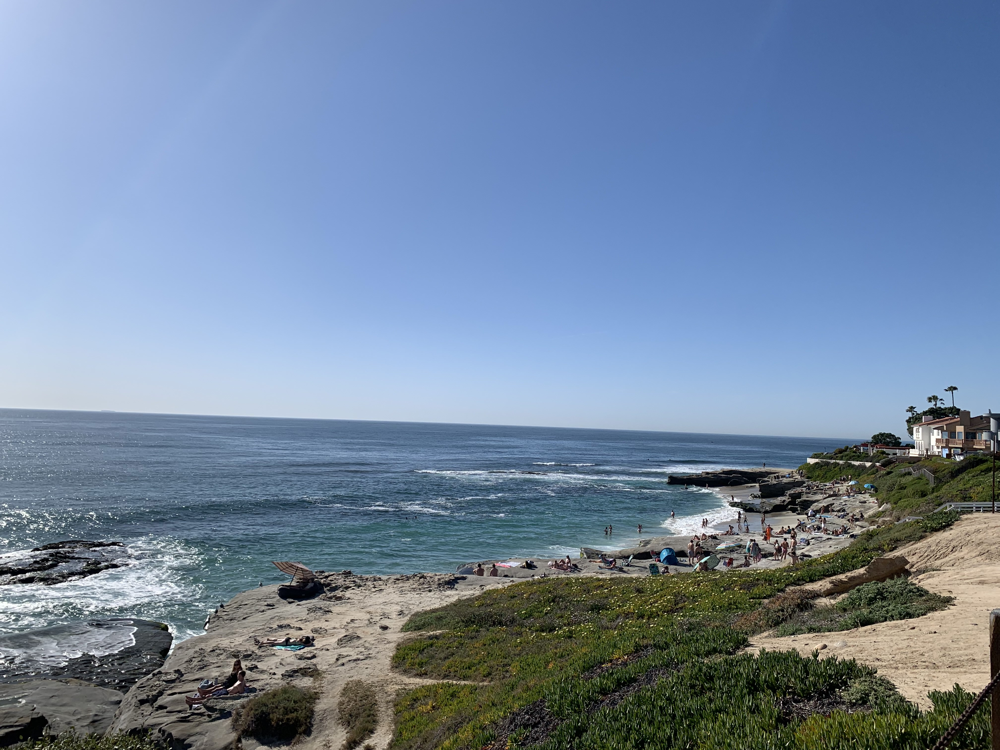
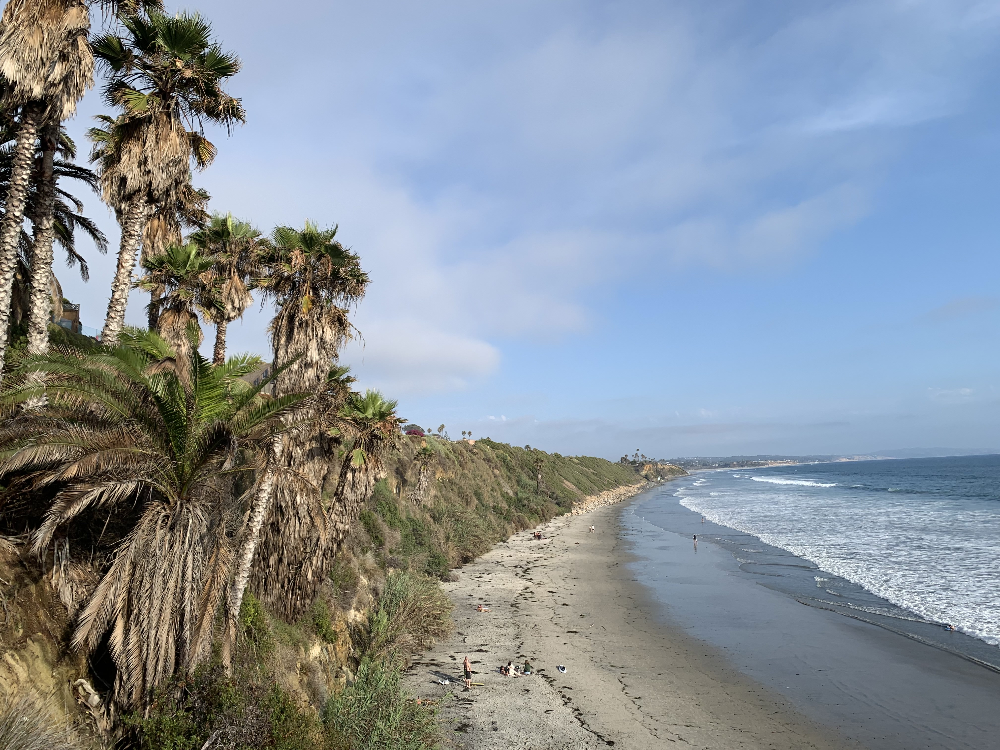
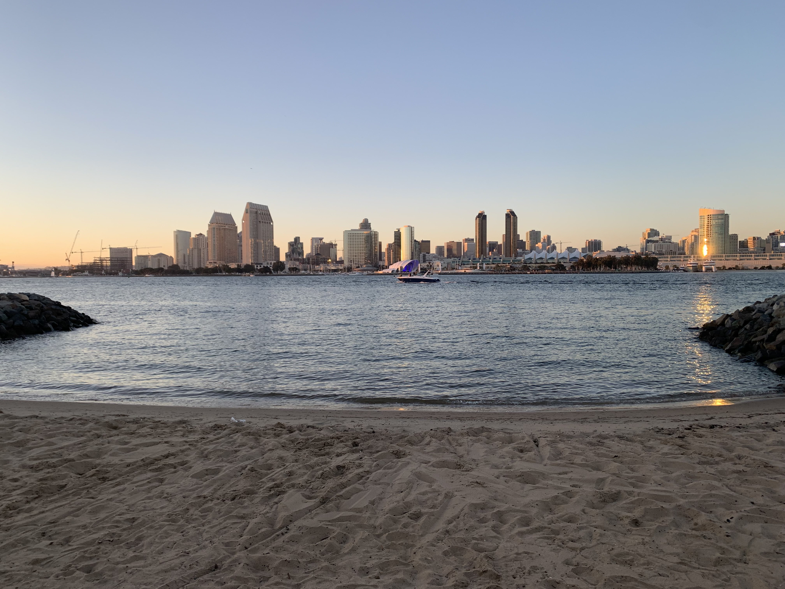
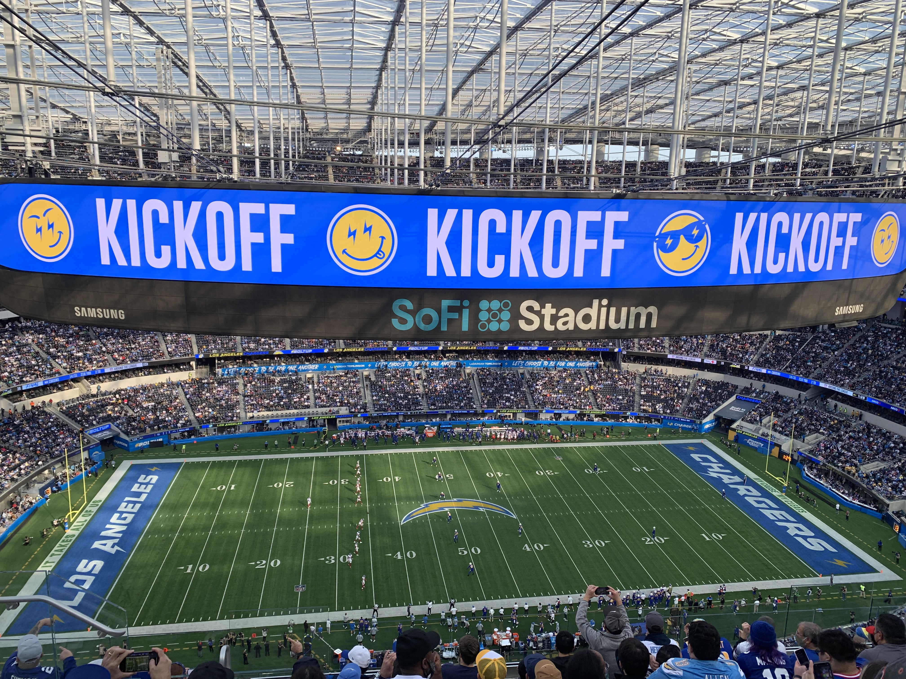

# Alessandra's User Page

## Section Shorcuts
- [x] [About Me](#about-me)
- [ ] [Education](#education)
- [ ] [Hobbies](#hobbies)
- [ ] [Contact Information](#contact-information)

### About me

> If you don't fight for what you want, don't cry for what you lose.

 A quote I like 

Hello! My name is Alessandra Tjitro (she/her). I was born and raised in San Diego, California. Here are some photos I've taken recently:

### Education

I am an undergraduate at the **University of California San Diego** pursuing a *B.S.* in computer science. I will be graduating in December of 2024.

I chose to pursue computer science because

* I took an introductory course in high school that I really enjoyed. I thought that `for` and `while` loops were really interesting.
* I think this degree is very versatile and will hopefully allow me to explore different careers

### Hobbies

My family and I are ~~San Diego~~ LA Chargers fans. We were bigger fans before they left however we still root for them, just maybe not *as* much as before.

Some of our favorite Chargers are
1. Phillip Rivers
2. Antonio Gates
3. Junior Seau

Here's a photo from when I saw SoFi stadium:

**I also love going to the gym and cooking _new_ recipes.**

## Contact Information

 Feel free to reach out through any of these! 

***Personal Email:*** amtjitro@gmail.com

***School Email:*** amtjitro@ucsd.edu

***LinkedIn:*** [Connect with me](https://www.linkedin.com/in/alessandra-tjitro/)

Lastly, here's a [link](README.md) to the ReadMe file for some additional information.